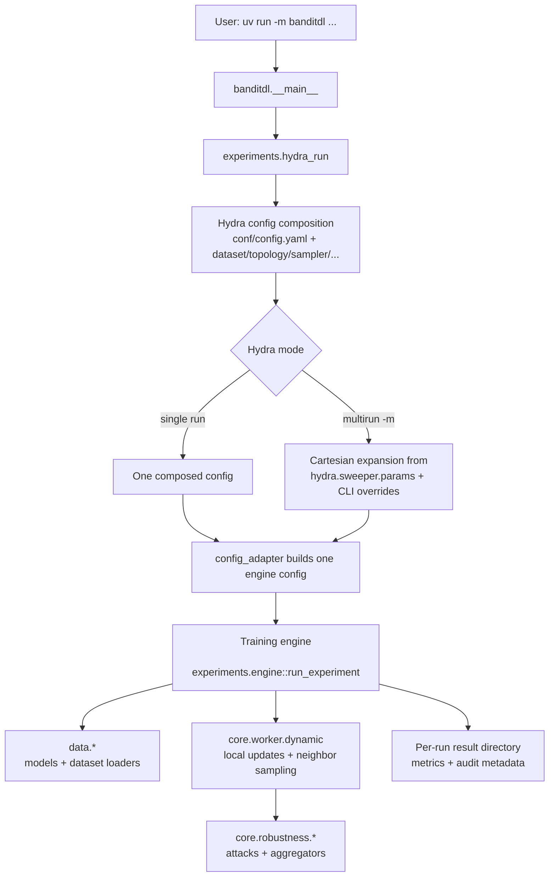
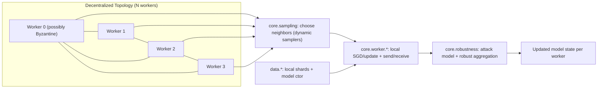

# banditdl

Hydra-multirun experiments for Byzantine-resilient decentralized learning.

## Setup

```bash
uv sync
```

If `uv` cache is not writable in your environment:

```bash
UV_CACHE_DIR=/tmp/uv-cache uv sync
```

## Run One Experiment

```bash
uv run -m banditdl
```

Example overrides:

```bash
uv run -m banditdl dataset=mnist topology=dynamic sampler=uniform topology.nodes=100 topology.sampling=0.05 seed=0 num_seeds=3
```

Each configured trial runs `num_seeds` consecutive seeds: `seed`, `seed + 1`,
and so on. Public artifacts under `results/` are seed-averaged; raw per-seed
artifacts are kept under `results/seeds/seed_<value>/results/`. Runs print
lightweight progress to stdout: start metadata, result directory, periodic
decentralized-learning rounds, evaluation accuracy when available, and
completion.

## Local Hydra Override

`conf/config.yaml` intentionally loads `conf/override.yaml`. That file is ignored by Git and is where each person puts machine-specific defaults such as device and output directories.

Create `conf/override.yaml` locally:

```yaml
defaults:
  - override /dataset: mnist
  - override /topology: dynamic
  - override /sampler: uniform
  - override /adversary: none

seed: 0
num_seeds: 3
device: mps

hydra:
  run:
    dir: .hydra_runs_override/${now:%Y-%m-%d}/${now:%H-%M-%S}
  sweep:
    dir: .hydra_multirun_override/${now:%Y-%m-%d}/${now:%H-%M-%S}
```

Detailed config documentation lives in [docs/config.md](docs/config.md).
Sweep-specific documentation lives in [docs/sweeps.md](docs/sweeps.md).

## Run Sweeps (Hydra Multirun)

Hydra does orchestration. The custom in-repo scheduler is no longer the main path.

## Run Sweeps (Optuna)

Launch Optuna sweeps with Hydra output folders:

```bash
uv run python -m banditdl.experiments.sweep
```

Defaults (`conf/sweep.yaml`) compose `conf/config.yaml` plus `conf/optuna/sanitysweep.yaml`.

Behavior:
- Exhaustively enumerates valid Cartesian combinations when all `optuna.search_space` entries are categorical.
- Uses Optuna sampling and `optuna.n_trials` when the search space contains continuous `float` / `int` entries.
- Respects optional `when:` guards for conditional parameters such as sampler-specific hyperparameters.
- Runs one Optuna trial per non-seed configuration and repeats that configuration `num_seeds` times.
- Writes seed-averaged trial artifacts under `<hydra_run>/trials/<param_tokens>/results/` and raw seed artifacts under that directory's `seeds/` subfolder.
- Persists the Optuna study to `<hydra_run>/optuna.db` for offline sweep plotting.
- Tracks mean validation accuracy across seeds, selects the best trial, then re-runs all of its seeds with test evaluation under `<hydra_run>/best_trial_test_eval/results`.
- If `plot.enabled: true`, renders configured sweep plots under `<hydra_run>/sweep_artifacts/`.

Sweep plotting is controlled by `conf/sweep.yaml`:

```yaml
plot:
  enabled: true
  directions: [avg, worse]
  heatmaps:
    - x: heterogeneity.alpha
      y: topology.sampling
      group_by:
        - sampler.name
        - [sampler.name, sampler.params.epsilon]
      aggregate_by: avg
      render: [heatmap]
      exclude_metrics: []
  per_parameter:
    enabled: false
    exclude_metrics: []
```

Plotting rules:
- Heatmaps are explicit; the plotter no longer generates every possible axis pair.
- All known scalar metrics are plotted by default when present in result folders.
- `exclude_metrics` removes metrics for a specific plot family/spec.
- `direction` reduces a metric over timesteps/nodes: `avg` or `worse`.
- `aggregate_by` reduces extra swept dimensions not used by `x`, `y`, or the active `group_by` slice: `avg`, `min`, or `max`.
- `group_by` creates slices. A string creates one slice per value; a list creates one slice per value combination.
- Heatmap color scales are shared across slices for the same heatmap spec,
  metric, and direction.
- `render` defaults to `[heatmap]`; add `heatmap3d` for experimental static
  3D surfaces under `sweep_artifacts/heatmap3d/`.
- `per_parameter` remains available but is disabled by default.

Offline plotting can regenerate sweep plots without rerunning training:

```bash
uv run python scripts/plot_sweep.py .hydra_runs/<date>/<time>
```

Use a custom output directory if desired:

```bash
uv run python scripts/plot_sweep.py .hydra_runs/<date>/<time> --output-dir plots/my_sweep
```

For larger sweeps:

```bash
uv run python -m banditdl.experiments.sweep optuna=sweep
```

Note on Hydra composition: `conf/override.yaml` is loaded as the last entry of
`conf/config.yaml`'s defaults list. `conf/sweep.yaml` then composes `config`
first and selects the bundled `optuna` group afterwards. `override.yaml` can override fields owned by `config.yaml` and its sub-groups, while `optuna.*` is controlled by the selected Optuna config or CLI overrides.

### Ad-hoc Sweep From CLI

```bash
uv run -m banditdl -m \
  dataset=mnist \
  topology=dynamic \
  sampler=uniform,bandit \
  seed=0 \
  num_seeds=3 \
  topology.nodes=50,100 \
  topology.sampling=0.03,0.05 \
  sampler.params.epsilon=0.1,0.3 \
  optimization.nb_local_steps=1,3
```

## Existing Config Groups

Dataset:
- `mnist`
- `cifar10`
- `femnist`: natural writer-based partitioning
- `femnist_pool`: synthetic partitioning of pooled FEMNIST samples

Topology:
- `dynamic`

Sampler:
- `uniform`
- `bandit` (epsilon-greedy profile)
- `epsilon_greedy`
- `exp3`

Adversary:
- `none`
- `alie`

## Config Reference

Hydra config lives in `conf/`. The main entry point is `conf/config.yaml`.

Inspect the resolved config before launching a large run:

```bash
uv run -m banditdl --cfg job
```

### Top-Level Config

- `dataset`: dataset/model config group.
- `topology`: decentralized topology config group.
- `sampler`: dynamic neighbor sampler config group.
- `adversary`: Byzantine/adversarial setup config group.
- `aggregator`: robust aggregation config group.
- `heterogeneity`: data heterogeneity config group.
- `optimization`: local optimizer/training schedule config group.
- `evaluation`: evaluation cadence config group.
- `seed`: base random seed for one configured trial.
- `num_seeds`: number of consecutive seeds to run for each configured trial. Metrics and plots aggregate seed results as the outermost reduction.
- `device`: `auto`, `cpu`, or a torch device string such as `cuda`.

### Dataset Config

Dataset configs are in `conf/dataset/`.

- `dataset`: dataset name used in logs and run names.
- `model`: model constructor from `banditdl/data/models.py`, for example `cnn_mnist` or `cnn_cifar_old`.
- `numb_labels`: number of output classes.
- `provider`: Hydra-instantiated dataset loader.

`dataset=femnist` assigns one writer to each honest node and holds out complete
writers for global evaluation. `dataset=femnist_pool` pools all writers and
applies the selected `heterogeneity` profile like MNIST or CIFAR-10.

### Heterogeneity Config

Heterogeneity configs are in `conf/heterogeneity/`.
Each profile directly configures the synthetic partition strategy.

- `alpha`: Dirichlet data heterogeneity parameter passed as `dirichlet-alpha`.
- `clusters`: number of data-distribution clusters. `null` means one cluster per honest node.
- `classes_per_group`: labels assigned to each pathological cluster.
- `group_overlap`: overlap between consecutive pathological clusters.
- `gamma_similarity`: interpolation toward IID data in `[0, 1]`.

### Optimization Config

Optimization configs are in `conf/optimization/`.

- `batch_size`: training batch size.
- `loss`: torch loss class name, for example `NLLLoss`.
- `learning_rate`: optional SGD learning rate. Engine default is `0.5`.
- `learning_rate_decay`: optional worker learning-rate decay scale.
- `learning_rate_decay_delta`: optional step interval for learning-rate decay checks.
- `weight_decay`: SGD weight decay.
- `momentum_worker`: worker momentum.
- `rounds`: number of communication/training rounds. This is the sampler horizon.
- `nb_local_steps`: local SGD steps per communication round.

### Topology Config

Topology configs are in `conf/topology/`.

- `nodes`: total simulated participants, including Byzantine participants.
- `sampling`: fraction of other participants sampled each round.

### Sampler Config

Sampler configs are in `conf/sampler/`. They are used by dynamic topologies.

- `name`: sampler implementation: `uniform`, `epsilon_greedy`, `exp3`, `cucb`,
  `cts`, `discounted_cucb`, or `discounted_cts`.
- `reward`: `parameter_distance` or `cosine_similarity`.
- `params`: sampler-specific parameters such as `epsilon`, `gamma`, or
  `exploration`.

Shared runtime facts such as `topology.nodes`, sampled-neighbor count, `optimization.rounds`, and seed are passed to samplers through runtime context rather than duplicated in sampler config.
The reward can be overridden independently when comparing samplers, for example
`sampler=uniform sampler.reward=cosine_similarity`.

### Adversary Config

Adversary configs are in `conf/adversary/`.

- `byzcount`: number of declared and real Byzantine workers currently instantiated by the Hydra adapter.
- `byzantine_budget`: robustness budget `b_hat`. If unset/null, defaults to `byzcount`.
- `attack`: Byzantine attack name or `null`. Available attacks include `SF`, `LF`, `FOE`, `ALIE`, `mimic`, `auto_ALIE`, `auto_FOE`, `inf`.

### Aggregator Config

Aggregator configs are in `conf/aggregator/`.

- `pre_aggregator`: optional first-stage robust aggregation rule, commonly `nnm`.
- `aggregator`: robust aggregator, commonly `average` or `trmean`.
- `rag`: robust aggregation flag. Dynamic runs force this to `true`.

Available robust aggregators include `average`, `trmean`, `median`, `geometric_median`, `krum`, `multi_krum`, `nnm`, `bucketing`, `pmk`, `cc`, `mda`, `mva`, `monna`, `meamed`.

### Sweep Syntax

Ad-hoc sweep:

```bash
uv run -m banditdl -m \
  dataset=mnist,cifar10 \
  topology=dynamic \
  sampler=uniform,bandit \
  topology.nodes=50,100 \
  topology.sampling=0.03,0.05 \
  adversary=none \
  seed=0 \
  num_seeds=3
```

Hydra takes the Cartesian product of comma-separated override values.
Sweep `seed` only when you want separate base-seed trials; use `num_seeds` for
seed averaging within each trial.

## How To Create A New Experiment

1. Add or copy a config in `conf/dataset/`, `conf/topology/`, `conf/sampler/`, `conf/aggregator/`, `conf/heterogeneity/`, `conf/optimization/`, or `conf/adversary/`.
2. Compose them from the CLI with Hydra overrides.

Example:

```yaml
# conf/sampler/my_bandit.yaml
name: epsilon_greedy
reward: parameter_distance
params:
  epsilon: 0.1
  initial_value: 0.0
```

```yaml
# conf/topology/my_dynamic.yaml
nodes: 100
sampling: 0.05
```

Run it:

```bash
uv run -m banditdl dataset=mnist topology=my_dynamic sampler=my_bandit adversary=none
```

## Plot Saved Results

Each Hydra run writes artifacts directly in its run folder:
- `<hydra_run>/results/`: metrics as NumPy arrays (`validation_accuracy.npy`, `validation_loss.npy`, `global_accuracy.npy`, `train_loss.npy`, `test_accuracy.npy` when enabled, plus dynamic diagnostics).
- `<hydra_run>/plots/`: auto-generated plots for all supported metrics.

Example run folder:

```text
.hydra_runs_override/2026-05-05/12-26-01/
  .hydra/
  hydra_run.log
  results/
  plots/
```

Plotting logic is code-driven. Metric loading, transforms, and aggregations live in `banditdl/utils/metrics.py`; runtime figures are defined imperatively in `banditdl/utils/plotting.py`. The script `scripts/plot_results.py` remains as a thin offline CLI wrapper around those helpers.

Plot one run:

```bash
uv run python scripts/plot_results.py \
  .hydra_runs_override/<date>/<time>/results \
  -o .hydra_runs_override/<date>/<time>/plots/example.png
```

Compare multiple runs:

```bash
uv run python scripts/plot_results.py \
  .hydra_runs_override/<date>/<time-a>/results \
  .hydra_runs_override/<date>/<time-b>/results \
  --label uniform \
  --label bandit \
  -o comparison.png
```

Aggregate seed runs:

```bash
uv run python scripts/plot_results.py \
  .hydra_runs_override/<date>/*/results \
  --aggregate \
  --label "uniform mean" \
  -o uniform_seed_mean.png
```

Useful options:
- `--metric validation_accuracy`: plot from `validation_accuracy.npy` (default).
- `--metric validation_loss`: plot from `validation_loss.npy`.
- `--metric global_accuracy`: plot from `global_accuracy.npy` (subsampled global test accuracy).
- `--metric train_loss`: plot from `train_loss.npy`.
- `--metric test_accuracy`: plot from `test_accuracy.npy`.
- `--metric regret`: plot regret against the best fixed neighbor subset in hindsight.
- `--metric normalized_regret`: plot time-averaged regret, derived from `regret.npy`.
- `--metric reward_algorithm|reward_oracle`: plot cumulative reward curves,
  normalized by sampled-neighbor count.
- `--metric reward_selected_min|reward_selected_max`: plot per-round selected
  neighbor reward extrema.
- `--metric neighbor_disagreement`: plot mean/median/max neighbor disagreement over rounds.
- `--metric consensus_drift`: plot mean/median/max drift from the global average model.
- `--metric sampler_aggressiveness`: plot KL to uniform plus min/max sampler probabilities.
- `--metric sampler_kl_to_uniform`: plot KL-to-uniform node aggregates derived from `sampler_probabilities.npy`.
- `--stat mean|worst`: choose mean worker or worst worker; for regret, worst means highest regret.
- `--legend outside|best|none`: choose legend placement; default keeps it below the plot.
- `--max-label-length 48`: cap auto-generated labels.

## Runtime Architecture

This section describes runtime execution logic and module interactions.

### Runtime Interaction Diagram



### End-to-end Flow

1. You run `uv run -m banditdl ...`.
2. `banditdl.__main__` dispatches to `banditdl.experiments.hydra_run`.
3. Hydra composes config from `conf/`.
4. In multirun mode, Hydra generates one run per parameter combination.
5. For each run, `hydra_run` invokes the training engine.
6. Training engine (`experiments.engine`) executes and writes results.

### Responsibilities By Module

- `banditdl.experiments.hydra_run`
  - Hydra entry point.
  - Dispatches one composed run to the engine.

- `banditdl.experiments.config_adapter`
  - Validates the composed Hydra config.
  - Computes sampled-neighbor count and run name.

- `banditdl.experiments.engine`
  - Dynamic decentralized-learning execution logic.
  - Drives training/evaluation loops and persistence.

- `banditdl.core.worker.*`
  - Worker logic for local updates and communication.

- `banditdl.core.robustness.*`
  - Byzantine attacks and robust aggregation rules.

- `banditdl.data.*`
  - `providers`: loads a dataset into training/evaluation views and metadata.
  - `partitioning`: assigns sample indices using synthetic or natural strategies.
  - `dataset`: builds loaders and returns a typed `DatasetBundle`.
  - `models`: model construction.

- `banditdl.core.sampling`
  - Neighbor sampler implementations and reward strategies.


### Terminology: Worker = Node

In this repository, a **worker** is one decentralized learning participant (node/client):
- it owns local train/test data loaders,
- performs local optimization steps,
- communicates with neighbors,
- applies robust aggregation logic under Byzantine settings.

Honest participants are modeled as `DynamicWorker`; Byzantine participants are explicit attack-only nodes.

### Decentralized Structure Diagram



Interpretation:
- Each worker is a simulated node with its own local data and model copy.
- Communication is peer-to-peer, not centralized; each node exchanges updates with selected neighbors.
- Dynamic topologies re-sample neighbors each round through `core.sampling`.
- Received updates pass through Byzantine attack/aggregation logic before updating local state.

## Sampling / Bandit Hook Points

- `banditdl/core/sampling.py`
- `banditdl/experiments/engine.py`
- `banditdl/core/worker/`

Use the epsilon-greedy bandit sampler:

```bash
uv run -m banditdl \
  dataset=mnist \
  topology=dynamic \
  sampler=bandit \
  sampler.params.epsilon=0.1 \
  topology.sampling=0.05 \
  seed=0
```

Use EXP3:

```bash
uv run -m banditdl \
  dataset=mnist \
  topology=dynamic \
  sampler=exp3 \
  sampler.params.gamma=auto \
  topology.sampling=0.05 \
  seed=0
```

Use combinatorial UCB or Thompson sampling:

```bash
uv run -m banditdl sampler=cucb
uv run -m banditdl sampler=cts
uv run -m banditdl sampler=discounted_cucb sampler.params.gamma=0.99
uv run -m banditdl sampler=discounted_cts sampler.params.gamma=0.99
```

Keep reward choice constant in algorithm comparisons:

```bash
uv run -m banditdl --multirun \
  sampler=uniform,cucb,cts \
  sampler.reward=cosine_similarity
```

Current bandit feedback:
- each neighbor is one arm,
- each round selects multiple arms and observes one reward per selected arm,
- MABWiser provides epsilon-greedy; the semi-bandit samplers are implemented locally,
- dynamic workers update selected arms after receiving neighbor weights,
- reward is selected through a strategy object,
- `parameter_distance` uses `1 / (1 + parameter_distance)` against the local model before aggregation.
- `cosine_similarity` maps parameter cosine similarity from `[-1, 1]` to `[0, 1]`.
- discounted CUCB and CTS exponentially discount evidence by `gamma`.

Dynamic runs also save hindsight diagnostics for every sampler, including uniform:
- `reward_algorithm.npy`: cumulative reward achieved by sampled neighbors,
  normalized by sampled-neighbor count.
- `reward_oracle.npy`: cumulative reward of the best fixed neighbor subset in
  hindsight, normalized by sampled-neighbor count.
- `regret.npy`: `reward_oracle - reward_algorithm`.
- time-averaged regret is derived from `regret.npy` when plotting.
- `reward_selected_min.npy`: per-round, per-node minimum reward among selected neighbors.
- `gradient_norms.npy`: per-round, per-node norm of the applied local gradient update; `plots/gradient_norm_loglog.png` shows average, worst, and best curves on log-log axes.
- `reward_selected_max.npy`: per-round, per-node maximum reward among selected neighbors.
- `selected_neighbors.npy`: sampled neighbors per round and worker.
- `oracle_neighbors.npy`: best fixed hindsight neighbors per round and worker.
- `sampler_weights.npy`: normalized sampler preference scores with shape
  `(rounds, honest_workers, total_nodes)`.
- `sampler_probabilities.npy`: per-round sampler probabilities with shape `(rounds, honest_workers, total_nodes)`.
- probabilities represent normalized top-k inclusion mass, `P(arm is selected) / k`;
  stochastic samplers estimate it without changing the sampler's training RNG.
- KL-to-uniform, entropy, minimum, and maximum curves are derived from the saved
  weights and probabilities when plotting.
- `audit.json`: partition parameters, participant counts, and each honest node's sample/label distribution.

Metric arrays are checkpointed every ten rounds and at shutdown. Sampler weights
and probabilities are written round-by-round; unfinished trailing rounds remain
`NaN` and are ignored by loaders and plots.

The automatic plot `plots/sampler_aggressiveness.png` shows:
- KL divergence to uniform aggregated across nodes by average, median, min, and max.
- sampler entropy and the global min/max probabilities per round.

`plots/sampler_weights.png` reports the same summaries for sampler preference
weights.

This is intentionally small: sampler choice and sampler-specific parameters are Hydra-controlled, shared runtime facts are passed through `SamplerContext`, and reward design remains isolated behind the reward strategy API in `banditdl/core/sampling.py`. For EXP3, `gamma: auto` uses `optimization.rounds` as the known horizon.
